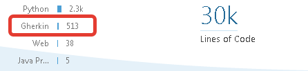

# SonarQube Gherkin Lang Support

implements continuous code inspect for Gherkin (BDD) Lang

## Features

* Gherkin 4 Parser - create an issue if feature is not correct writen
* Spell Check English and Russian - create an issue when developer had a mistakes in typo

## Metrics

* compute classes, function and statements as feature, scenario and steps
* compute count of features, scenarios and steps as design domain metrics

## Gherkin Lint

* after cucumber.io released official Gherkin Lint - we implements there result through the event API
  
## Spell Check on i18n

* spellchecker implementation based on https://languagetool.org/

## License and contribute

* GNU

if you want to contribute:

* do not forget write Cucumber-JVM Tests or JUnit Tests 
* use github-flow as a process - fork, commit, pull-request with feature-branching
* fix the sonarqube issues in your pull request
